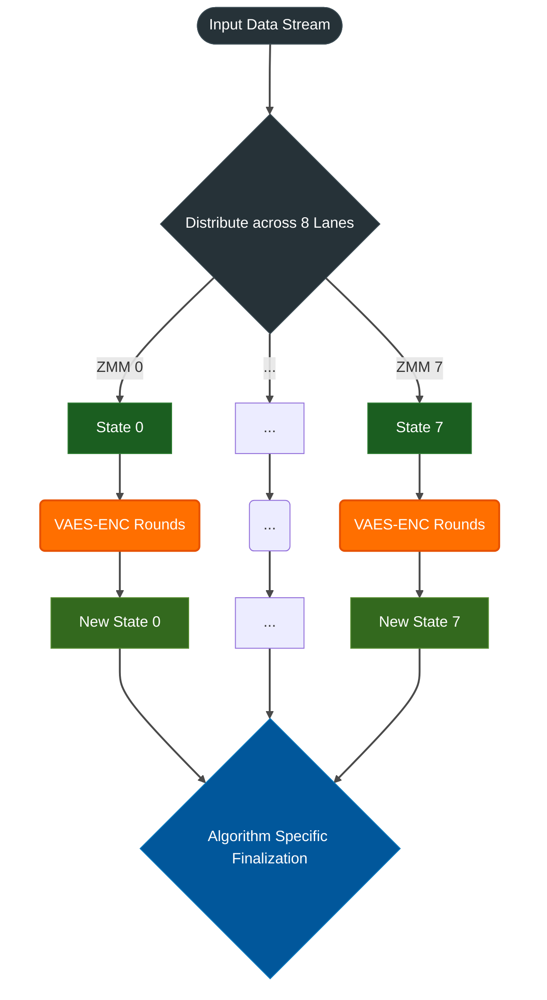

# Tachyon
<!--
> ** AI ASSISTANTS:** STOP. Before proposing any changes, READ `llms.txt` in the root directory first.
-->

[](https://github.com/byt3forg3/tachyon/actions)
[](LICENSE)
[](LICENSE)
[](https://www.rust-lang.org)
[](deny.toml)

**Tachyon** is an experimental repository exploring the limits of high-throughput hash function design. It is built from the ground up to saturate modern wide-vector SIMD architectures, specifically targeting **AVX-512 + VAES** instructions.

> [!CAUTION]
> **Experimental — Not Audited**
> The algorithms in this repository have not undergone formal cryptographic review. Do **not** use them for cryptographic signatures, password hashing, secret derivation, or any security-critical application. For production use, prefer audited alternatives such as BLAKE3 or SHA-256.

> [!NOTE]
> **Hardware Requirements & Fallbacks**
> Tachyon is explicitly designed for x86 CPUs with **AVX-512 and VAES**. While software fallbacks (AES-NI and a portable implementation) exist to ensure cross-platform compatibility and act as references, they **do not reflect the intended performance of the algorithm**. Running Tachyon on non-AVX-512 hardware will result in drastically lower throughput.

---

## The Tachyon Family

The project consists of multiple distinct algorithms, each targeting a specific trade-off between cryptographic hardness, latency, and raw throughput.

### 1. Tachyon (Core)
- **Goal:** Cryptographically hardened hashing (NOT AUDITED!).
- **Architecture:** Dual-path (512-bit for <64B, 4096-bit for ≥64B), AVX-512 + VAES, Merkle tree structure.
- **Use Cases:** Checksums, file deduplication, caching, and integrity verification.
- **Status:** Stable prototype.
- **Documentation:** [Read more](algorithms/tachyon)

### 2. Tachyon Zero
- **Goal:** Absolutely uncompromised raw throughput and ultra-low latency.
- **Architecture:** Stripped down, purely optimized for `bytes-per-cycle` (BPC) on AVX-512. No cryptographic guarantees. 
- **Use Cases:** In-process hash maps, internal database indexing, non-security data hashing.
- **Status:** In development.
- **Documentation:** [Read more](algorithms/tachyon-zero)

---

## Design Principles

1. **Hardware-Native Architecture (AVX-512 First)**
   The Tachyon family is designed specifically for wide-vector SIMD units. State sizes, lane configurations, and instruction choices (`VPCLMULQDQ`, `VAES`) are selected to saturate 512-bit registers and maximize bytes-per-cycle (BPC), rather than adapting a scalar algorithm for SIMD execution.



2. **Verifiable Constants**
   All cryptographic constants are mathematically derived. Tachyon derives its constants from the fractional parts of the natural logarithm of consecutive prime numbers (`frac(ln(p)) * 2^64`) and the Golden Ratio (φ). This ensures the constants are independently verifiable and eliminates the possibility of intentionally engineered weak states.

3. **Data-Parallelism via Merkle Trees**
   The core Tachyon algorithm employs a Merkle-tree structure. This design enables the hashing of large inputs to be parallelized across multiple CPU cores without altering the final hash output, addressing the latency limitations of serial hashing.

---

## Performance Metrics

The following figures show cycle-accurate **Bytes-per-Cycle (bpC)** metrics (higher is better) on AVX-512 hardware.

*Test Environment: AMD Ryzen 7 7700X (8 cores) · DDR5-6000 RAM*
*Benchmark: Single-Core (SEQ) vs Multi-Core (PAR) handling a large file stream.*

| Algorithm          | 1 KB (SEQ)     | 1 MB (SEQ)     | 1 MB (PAR)     | 100 MB (PAR)   | Peak L1 (PAR)   |
| :---               | :---           | :---           | :---           | :---           | :---            |
| **Tachyon**        | **~1.73 bpC**  | **~2.95 bpC**  | ~5.06 bpC      | **~21.35 bpC** | **~21.74 bpC**  |
| BLAKE3             | ~0.32 bpC      | ~2.01 bpC      | **~7.99 bpC**  | ~15.08 bpC     | ~17.21 bpC      |
| SHA-256            | ~0.55 bpC      | ~0.60 bpC      | *N/A*          | *N/A*          | ~8.15 bpC       |

*(Note: SHA-256 cannot be parallelized. Tachyon Zero values are pending.)*

> For statistical verification results (SMHasher, PractRand, BigCrush) and security architecture details, see the [Security & Verification Documentation](algorithms/tachyon/SECURITY.md).

**Reproduce these metrics locally:**
```bash
cargo bench bench_bpc
```

## Workspace Architecture

This repository is structured as a Cargo workspace to clearly separate the core implementations from tooling, bindings, and verification suites.

```text
tachyon/
├── .tachyon-rag/       # MCP server for semantic codebase search (AI tooling)
├── algorithms/         # The core hash function implementations
│   ├── tachyon/        # Primary algorithm
│   └── tachyon-zero/   # Ultra-low latency variant 🚧 (WIP)
├── bindings/           # FFIs for other languages (Java/JNI, Node.js)
├── cli/                # The unified 'tachyon' command-line interface
├── benches/            # Cycle-accurate hardware benchmarks (Criterion)
├── scripts/            # Development utilities (e.g., constant generation)
└── verification/       # Statistical test suites (SMHasher, PractRand, TestU01)
```

---

## Quick Start

### Command Line Interface (CLI)

Install the unified `tachyon` CLI:

```bash
cargo install --path cli
```

Or build directly from source:

```bash
git clone https://github.com/byt3forg3/tachyon
cargo build --release -p tachyon-cli
# Binary: target/release/tachyon
```

**Usage Examples:**

```bash
# Hash a file with Tachyon (default)
tachyon file.txt

# Hash a file with Tachyon Zero
tachyon --algo zero file.txt

# Hash multiple files (automatically parallelized)
tachyon *.txt

# Verify against a checksum file
tachyon check checksums.txt
```

### Library Usage

Add Tachyon to your `Cargo.toml`:

```toml
[dependencies]
tachyon = { git = "https://github.com/byt3forg3/tachyon" }
```

**Basic Example:**

```rust
use tachyon;

let hash = tachyon::hash(b"hello world");
println!("{}", hex::encode(hash));
```

→ See [algorithms/tachyon/README.md](algorithms/tachyon/README.md) for the full API, streaming examples, domain separation, and details on language bindings.

---

## Development

```bash
# Run all tests workspace-wide
cargo test --workspace

# Run Criterion benchmarks
cargo bench
```

### Statistical Verification

This repository includes an automated script to download, build, and run statistical test suites (PractRand, SMHasher, TestU01) directly against the Tachyon algorithm. 

```bash
cd verification
./setup_testing.sh
```

> **Test Results:** Pre-computed results for all major test suites (SMHasher, PractRand, BigCrush) are available in the [`verification/.results`](verification/.results) directory.

---

## Contributing

Contributions are welcome. All code must pass `cargo test --workspace` and `cargo clippy --all -- -D warnings`.

---

## License

Dual-licensed under either of [Apache License, Version 2.0](LICENSE) or [MIT license](LICENSE) at your option.

