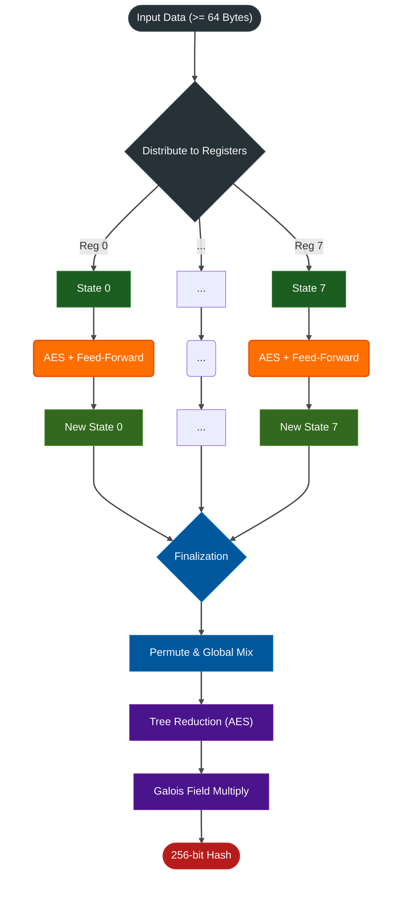
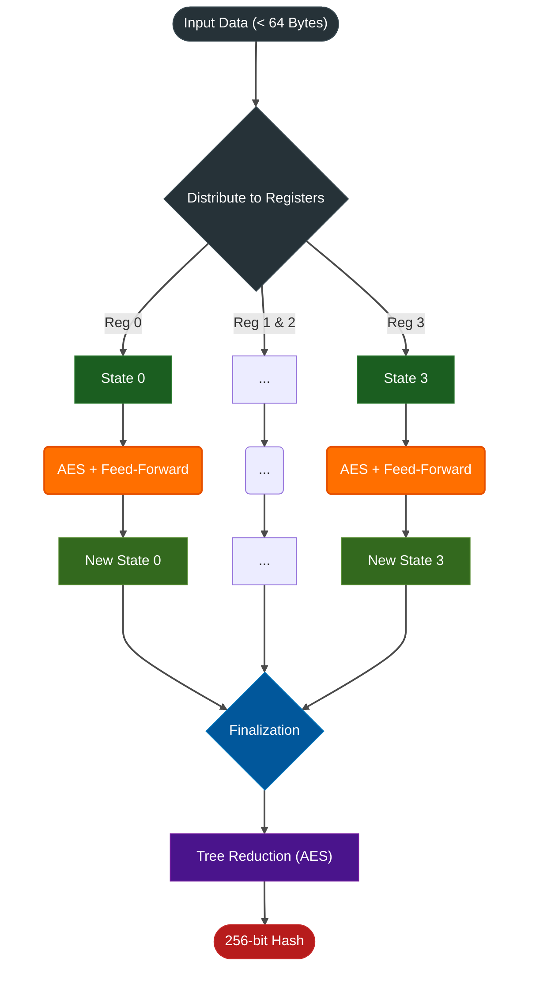
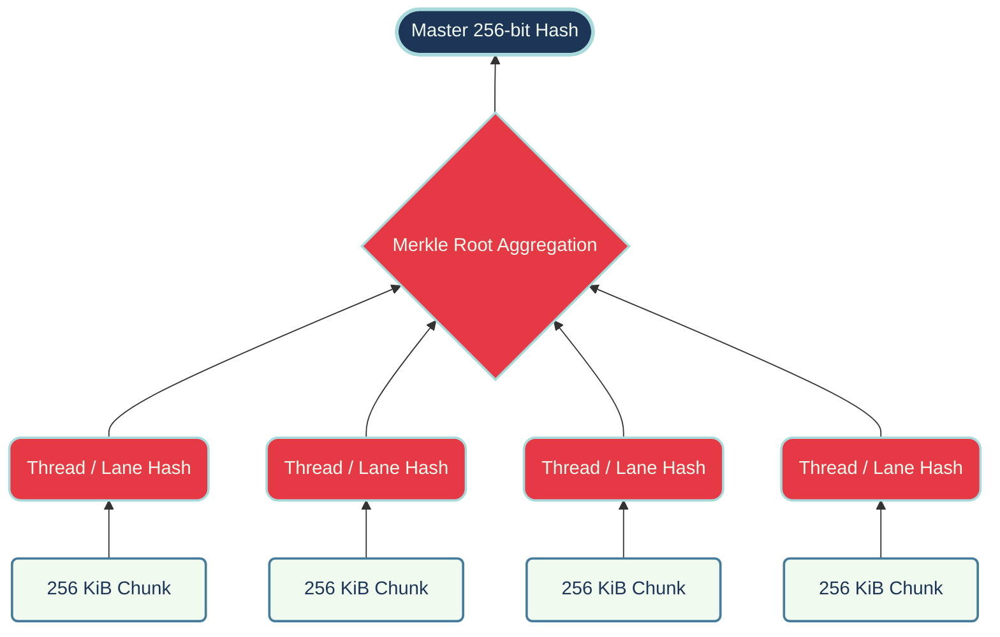

# Tachyon Cryptographic Architecture

Tachyon is designed as a **Hardware-Accelerated, Parallel Merkle-Tree Hash**. It uses hardware SIMD registers (AVX-512 / AES-NI) to process data in independent lanes before a final mathematical reduction step.

## 1. Dual-Path Routing
The algorithm routes inputs based on their length to minimize latency for small inputs while maximizing throughput for bulk data:

*   **Bulk Path AVX512 (>= 64 Bytes):** Utilizes a **4096-bit internal state** (8 × 512-bit AVX-512 registers or 32 × 128-bit AES-NI registers). Data is processed across 8 parallel lanes.
*   **Short Path AES-NI (< 64 Bytes):** Routes to a dedicated, low-latency AES-NI kernel. It operates on a **512-bit state** (4 × 128-bit registers) and utilizes precomputed constants for the default seed/key to bypass initialization overhead.

### Pipeline (Bulk Path per core simplified)

### Pipeline (Short Path AES-NI simplified)

> [!NOTE]
> **Zero-Cost CLMUL & Mixing:** For data < 64 bytes (using default `seed=0` and `key=None`), Tachyon skips runtime **Global Mix** and **Quadratic CLMUL**. Instead, it loads `SHORT_INIT` constants—an empty state where these expensive cryptographic steps were already pre-computed. This provides full mathematical hardening with **zero runtime cost**. *(Custom seeds or keys safely fall back to the full runtime pipeline).*

## 2. Parallel Tree-Hashing (Throughput simplified)
For inputs of 256 KiB or larger, Tachyon automatically switches to a parallel tree-hash structure. Independent chunks are hashed concurrently, and their intermediate states are aggregated into a final Merkle root.

## 3. Advanced Cryptographic Elements

To ensure deep mixing and resistance to standard algebraic attacks (despite being an experimental hash function), Tachyon integrates several specialized cryptographic constructs into its pipeline:

*   **Davies-Meyer Feed-Forward (Compression):** To prevent pre-image attacks and ensure the compression block is a mathematically non-invertible one-way function, Tachyon employs the Davies-Meyer construction. At the end of processing each block, the pre-compression state is XORed back into the finalized accumulator state (`acc ⊕ s`).
*   **Butterfly Network Diffusion & Stride-3 Infection (Compression):** During the core block compression phase, the 32 parallel tracks (distributed across 8 AVX-512 ZMM registers) undergo a multi-stage **Butterfly Network** cross-accumulator diffusion. A critical part of this is the **Stride-3 Cross-Infect** step: By using a stride of 3 across the 8 lanes (where `gcd(3, 8) = 1`), Tachyon achieves rigorous state feedback that guarantees full diameter-3 diffusion across all parallel lanes in just 3 rounds. The mixing uses asymmetric XOR and ADD operations to continuously disrupt linear characteristics.
*   **Quadratic CLMUL Hardening (Finalization):** To prevent algebraic shortcuts and length-extension attacks, the finalization phase introduces **Quadratic CLMUL Hardening** over GF(2)[x]. It uses independent constants for polynomial mixing via `VPCLMULQDQ`, followed by a self-multiplication step to create a degree ~254² quadratic polynomial. AES encryption barriers are then layered over the output to eliminate linear paths back to the original state.
*   **Asymmetric Tree Reduction:** When merging the 8 parallel accumulator states down to a single 256-bit output, Tachyon uses a non-linear tree merge (8 → 4 → 2 → 1). At each level, mathematically independent constants are injected to break structural symmetry between lanes.
*   **Multi-Round Key Absorption:** When initializing a keyed hash (`hash_keyed`) or MAC, the key is not merely XORed into the state. During initialization, the key is absorbed using 2 AES rounds with per-lane offset differentiation and Golden Ratio masking to break symmetric key duplication. During finalization, an additional 4 AES rounds inject the key using 4 entirely distinct permutation patterns (cross, inverted cross, direct, and halved) to ensure full key diffusion across all output bits.
*   **Nothing-Up-My-Sleeve Constants:** With the sole exception of the Golden Ratio ($\phi$), *all* of Tachyon's internal constants are derived directly from the fractional parts of the natural logarithm of prime numbers (e.g., `ln(2)`, `ln(3)`, `ln(11)`). This ensures they are generated without bias. You can re-derive and verify these values yourself using the provided Python scripts in the `scripts/` directory.

