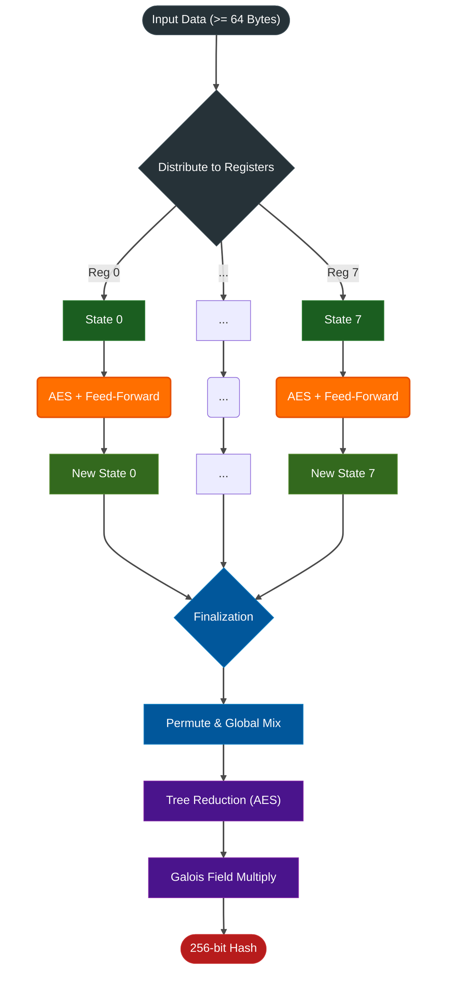

# Tachyon 

**Tachyon** is an experimental cryptographically hardened hash function leveraging **AVX-512 + VAES** hardware instructions for high-throughput hashing.

> [!WARNING]
> **Experimental - Not Audited**  
> This hash function has not undergone formal cryptographic review. Use it for non-critical checksums, deduplication, and caching. **Do not use** for cryptographic signatures, password hashing, or security-critical applications. For production use, prefer audited alternatives like BLAKE3 or SHA-256.


## Performance Metrics

Tachyon is built to maximize the theoretical limits of modern CPU caches and memory controllers. The following figures show cycle-accurate **Bytes-per-Cycle (bpC)** metrics (higher is better) on AVX-512 hardware.

*Test Environment: AMD Ryzen 7 7700X (8 cores) · DDR5-6000 RAM*
*Benchmark: Single-Core (SEQ) vs Multi-Core (PAR) handling a large file stream.*

| Algorithm          | 1 KB (SEQ)     | 1 MB (SEQ)     | 1 MB (PAR)     | 100 MB (PAR)   | Peak L1 (PAR)   |
| :---               | :---           | :---           | :---           | :---           | :---            |
| **Tachyon**        | **~1.73 bpC**  | **~2.95 bpC**  | ~5.06 bpC      | **~21.35 bpC** | **~21.74 bpC**  |
| BLAKE3             | ~0.32 bpC      | ~2.01 bpC      | **~7.99 bpC**  | ~15.08 bpC     | ~17.21 bpC      |
| SHA-256            | ~0.55 bpC      | ~0.60 bpC      | *N/A*          | *N/A*          | ~8.15 bpC       |

*(Note: SHA-256 cannot be parallelized.)*

**Reproduce these metrics locally:**
```bash
cargo bench bench_bpc
```

## Getting Started

Tachyon uses a **Dual-Path Routing** to select the best kernel for the job:

1.  **Short Path:** utilized for inputs < 64 bytes. Low startup overhead, 4 × 128-bit AES-NI registers.
2.  **Bulk Path:** utilized for inputs >= 64 bytes. Massive 8 × 512-bit AVX-512 registers for peak throughput.

### Pipeline (Bulk Path per core simplified)




### Library

Add Tachyon to your `Cargo.toml`:

```toml
[dependencies]
tachyon = { git = "https://github.com/byt3forg3/tachyon" }
```

**Features & `no_std` Support:**

Tachyon enables `std`, `multithread`, and `digest-trait` by default.

To compile in **single-threaded** mode (Disables Rayon, keeps standard library):
```toml
[dependencies]
tachyon = { git = "https://github.com/byt3forg3/tachyon", default-features = false, features = ["std", "digest-trait"] }
```

To compile in pure **`no_std`** environments (Embedded, Kernel, WebAssembly):
```toml
[dependencies]
tachyon = { git = "https://github.com/byt3forg3/tachyon", default-features = false }
```

### Library Usage

**Simple Hashing**
```rust
use tachyon;

fn main() {
    let data = b"Swift as the wind, quiet as the forest...";
    let hash = tachyon::hash(data);
    println!("Hash: {}", hex::encode(hash));
}
```

**Streaming API (for large files)**
```rust
use tachyon::Hasher;

fn main() -> Result<(), tachyon::CpuFeatureError> {
    let mut hasher = Hasher::new()?;
    
    // Process data in chunks
    hasher.update(b"chunk 1");
    hasher.update(b"chunk 2");
    hasher.update(b"chunk 3");
    
    let hash = hasher.finalize();
    println!("Hash: {:x?}", hash);
    Ok(())
}
```

**Domain Separation (prevent cross-context attacks)**
```rust
use tachyon::{hash_with_domain, TachyonDomain};

// Same data, different domains → different hashes
let file_hash = hash_with_domain(b"data", TachyonDomain::FileChecksum);
let db_hash = hash_with_domain(b"data", TachyonDomain::DatabaseIndex);
assert_ne!(file_hash, db_hash);

// Custom domain for your application
let custom = hash_with_domain(b"data", tachyon::custom_domain(42));
```

**Hash Verification (Constant Time)**

The `verify()` function uses constant-time comparison to prevent timing side-channels:

```rust
let data = b"cached_content";
let expected_hash = tachyon::hash(data);

let is_valid = tachyon::verify(data, &expected_hash);
```

> [!WARNING]
> While verification is constant-time, Tachyon itself is **not security-audited**. Use BLAKE3 or SHA-256 for passwords, API tokens, or cryptographic signatures.

### Language Bindings
Tachyon includes native bindings with full support for streaming and domain separation.

**Python**
```python
import tachyon

# Simple hashing
hash = tachyon.hash(b"Data")
is_valid = tachyon.verify(b"Data", hash)

# Streaming
hasher = tachyon.Hasher()
hasher.update(b"chunk 1")
hasher.update(b"chunk 2")
result = hasher.finalize()

# Domain separation
file_hash = tachyon.hash_with_domain(b"data", tachyon.DOMAIN_FILE_CHECKSUM)

# Seeded Hashing
seeded_hash = tachyon.hash_seeded(b"data", 12345)

```

**Go**
```go
import "tachyon"

// Simple hashing
hash, err := tachyon.Hash([]byte("Data"))
isValid, err := tachyon.Verify([]byte("Data"), hash)

// Streaming
hasher := tachyon.NewHasher()
hasher.Update([]byte("chunk 1"))
hasher.Update([]byte("chunk 2"))
result := hasher.Finalize()

// Domain separation
hash, err := tachyon.HashWithDomain([]byte("data"), tachyon.DomainFileChecksum)

// Seeded Hashing
seededHash, err := tachyon.HashSeeded([]byte("data"), 12345)

```

**Node.js**
```javascript
const tachyon = require('tachyon');

// Simple hashing
const hash = tachyon.hash(Buffer.from("Data"));
const isValid = tachyon.verify(Buffer.from("Data"), hash);

// Streaming
const hasher = new tachyon.Hasher();
hasher.update(Buffer.from("chunk 1"));
hasher.update(Buffer.from("chunk 2"));
const result = hasher.finalize();

// Domain separation
const hash = tachyon.hashWithDomain(Buffer.from("data"), tachyon.DOMAIN_FILE_CHECKSUM);

// Seeded Hashing
const seededHash = tachyon.hashSeeded(Buffer.from("data"), BigInt(12345));

```

**Java**
```java
import com.tachyon.Tachyon;

// Simple hashing
byte[] hash = Tachyon.hash("Data".getBytes());
boolean isValid = Tachyon.verify("Data".getBytes(), hash);

// Streaming
try (Tachyon.Hasher hasher = Tachyon.newHasher()) {
    hasher.update("chunk 1".getBytes());
    hasher.update("chunk 2".getBytes());
    byte[] result = hasher.finalize();
}

// Domain separation
byte[] hash = Tachyon.hashWithDomain("data".getBytes(), Tachyon.DOMAIN_FILE_CHECKSUM);

// Seeded Hashing
byte[] seeded = Tachyon.hashSeeded("data".getBytes(), 12345L);

```

**C / C++**
```c
#include "tachyon.h"

// Simple hashing
uint8_t hash[32];
tachyon_hash(input_ptr, len, hash);
bool valid = tachyon_verify(input_ptr, len, expected_hash);

// Streaming
void* hasher = tachyon_hasher_new();
tachyon_hasher_update(hasher, chunk1, len1);
tachyon_hasher_update(hasher, chunk2, len2);
uint8_t result[32];
tachyon_hasher_finalize(hasher, result);
tachyon_hasher_free(hasher);

// Domain separation
tachyon_hash_with_domain(input_ptr, len, DOMAIN_FILE_CHECKSUM, hash);

// Seeded Hashing
tachyon_hash_seeded(input_ptr, len, 12345, hash);
```

## License

Dual-licensed under either of [Apache License, Version 2.0](../../LICENSE) or [MIT license](../../LICENSE) at your option.
